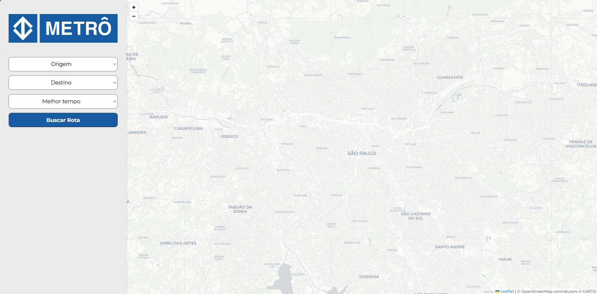
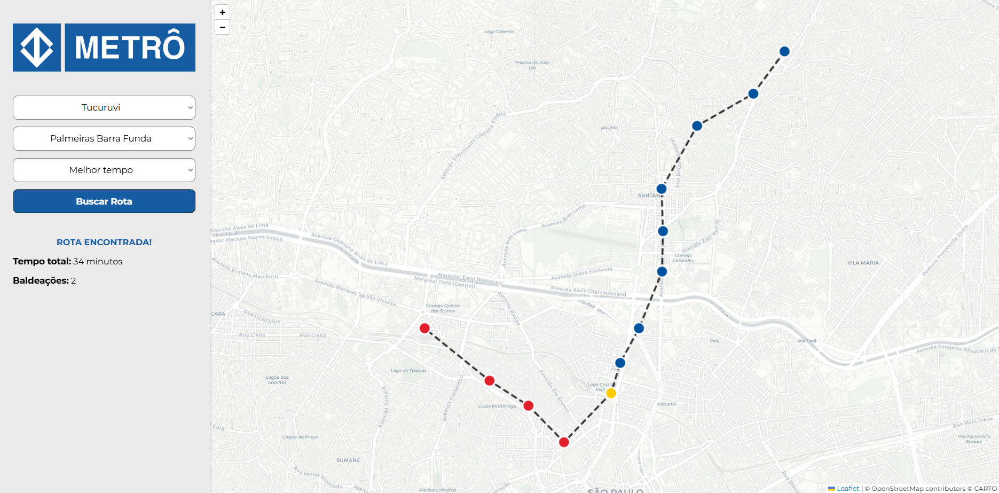
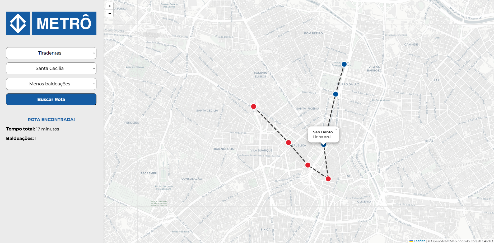

# Metrô SP - Melhor Rota

Número da Lista: 35<br>
Conteúdo da Disciplina: Grafos<br>

## Alunos
|Matrícula | Aluno |
| -- | -- |
| 21/1061860 | Henrique Martins Alencar |

## Vídeo de Apresentação

* https://youtu.be/GgFHNSu5JSA

## Sobre 

Este projeto tem como objetivo encontrar a rota ideal entre duas estações de metrô da cidade de São Paulo. O usuário informa a estação de origem e a estação de destino, além da preferência por melhor tempo ou menos baldeações. Para isso, a rede do metrô foi modelada como um Grafo, onde cada estação é um nó e a conexão entre duas estações é uma aresta, atribuindo pesos (tempo de viagem). Para encontrar o melhor caminho, foi utilizado o **Algoritmo de Dijkstra**, que percorre os nós e armazena o tempo gasto para realizar aquele caminho, devolvendo a rota realizada em menor tempo.  

## Screenshots

### Página Inicial



### Busca por melhor tempo



### Busca por menos baldeações



## Instalação 
Linguagem: Python, JavaScript, HTML, CSS<br>
Framework: Flask e Leaflet.js<br>

### Pré-requisitos:

* Python 3.x

* Pip.

### Instalação e execução:

* Clone este repositório:

```bash
git clone https://github.com/projeto-de-algoritmos-2026/G35_Grafos_PA-26.1
cd G35_Grafos_PA-26.1
```

* Instale o Flask:

```bash
pip install flask
```

* Execute o servidor local:

```bash
python app.py
```

## Uso 

* Acesse o endereço: http://127.0.0.1:5000
* Escolha a estação de origem;
* Escolha a estação de destino;
* Clique em buscar;
* O resultado mostrará o tempo da viagem, número de baldeações e a rota sugerida mostrando cada estação.
